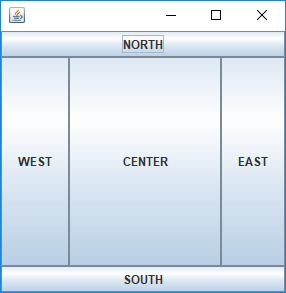
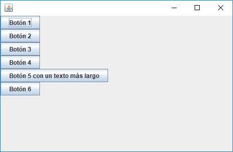

## Interfaces Gráficas en Java

### Índice
-	[El JFrame y las Ventanas](#JFrameyVentanas)
	-	[Métodos Relevantes del JFrame](#MetodosRelevantesDeJFrame)
	-	[Contenedor del JFrame](#ContenedorDelJFrame)

-	[Widgets (Elementos de Interfaz)](#Widgets)
	-	[Los Botones (JButton)](#JButton)
	-	[Etiquetas de Texto (JLabel)](#JLabel)
	-	[Entradas de Texto (JTextField)](#JTextField)
	-	[Cajas de Verificación (JCheckBox)](#JCheckBox)
	-	[Botones Radiales (JRadioButton)](#JRadioButton)
	-	[Listas Desplegables (JComboBox)](#JComboBox)

-	[Layouts](#Layouts)
	- [BorderLayout](#BorderLayout)
	- [GridLayout](#GridLayout)
	- [GridBagLayout](#GridBagLayout)
	- [BoxLayout](#BoxLayout)
	- [FlowLayout](#FlowLayout)

-	[Selección de Archivos y Directorios (JFileChooser)]()
-	[Cajas de Información JOptionPane (JOptionPane)](#MessageBox)
-	[Configuración de Look & Feel](#LookAndFeel)

### <a id="JFrameyVentanas">JFrame y las Ventanas</a>

Una clase que defina una ventana deberá heredar de la clase ***JFrame***, es decir que como plantilla, si tenemos una clase llamada **Window** que definirá una ventana de nuestro programa, entonces su definición debe tener el siguiente formato:

```java
public class Window extends JFrame
{
	/*Atributos*/
    /*Métodos  */
}
```
A su vez, cabe anotar que la clase **JFrame** puede ser utilizada, importando el paquete **swing** donde se encuentra declara, esto lo hacemos con la siguiente línea:
```java
import javax.swing.JFrame
```
Posee 3 tipos de constructor de los cuales los dos siguientes son las formas más utilizadas: `JFrame();` o `JFrame(String titulo)`

#### <a id="MetodosRelevantesDeJFrame">Métodos relevantes de JFrame</a>
A continuación, listaremos y presentaremos una breve descripción de algunos de los métodos más comunes de **JFrame** que utilizaremos en la creación de interfaces gráficas:
*	**.setBounds(posX, posY, Ancho, Alto)**: Se configura la posición en la cual aparecerá inicialmente.
*	**.setVisible(bool)**: Si su parámetro tiene presenta un valor **true**, hace visible el contendio del **JFrame** en pantalla.
*	**.add(widget)**: Agrega un elemento al contenido del **JFrame**.
*	**.setSize(ancho, alto)**: Modifica las dimensiones de la ventana que se está manipulando.
*	**.pack()**: Este método configura un tamaño automático necesario para que la todos los elementos de la ventana se muestren, se puede pensar que al hacer uso del mismo, se puede prescindir del método **.setSize** mostrado anteriormente.
*	**.setTitle(Título)**: Con esto se indica el título que llevará la ventana en su barra superior (la barra de título).
*	**.setLayout(layoutType)**: Configura el tipo de *layout* que deseamos utilizar dentro del JFrame (**ver: Layouts**).
*	**.setResizable(bool)**: Cuento su argumento vale *true*, se le permite a la ventana modificar sus dimensiones, cuando el parámetro vale *false* no se puede modificar el tamaño de la ventana en cuestión.
*	**.setDefaultCloseOperation(acción_cierre)**: Con esta línea se logra que se termine el proceso cuando la ventana se cierre.	Las acciones de cierre pueden ser las siguientes:

	*	**JFrame.EXIT_ON_CLOSE**: Abandona la aplicación.
	*	**JFrame.DISPOSE_ON_CLOSE**: Libera los recursos asociados a la ventana.
	*	**JFrame.DO_NOTHING_ON_CLOSE**: No hace nada.
	*	**JFrame.HIDE_ON_CLOSE**: Cierra la ventana, sin liberar sus recursos.

#### <a id="ContenedorDelJFrame">Contenedor del JFrame</a>
Como una anotación adicional, es importante comentar que existen dos formas de utilizar el método **.add( )**, en primer lugar se puede simplemente llamar el método desde el propio objeto *JFrame* para agregar un elemento, por ejemplo, a continuación agregaremos un objeto llamado **btn**:

```java
JFrame myFrame = new JFrame("My Frame");
.
.
.
myFrame.add(btn);
```

La siguiente forma corresponde a trabajar con el *Container* del *JFrame*, es decir, trabajar con un objeto que representa el interior del *JFrame*, el **contenedor de widgets.**
Para hacer uso de los contenedores debemos importar el módulo **Container** del paquete **awt** como se muestra en la siguiente línea:

`import java.awt.Container;`

Para obtener el contenedor o **contentPane** de un **JFrame** utilizamos el método ***.getContentPane( )***. El segmento de código de anterior, puede ser reemplazado por lo siguiente:

```java
JFrame myFrame = new JFrame("My JFrame and Container");
.
.
Container cp = myJFrame.getContentPane( );
cp.add(btn); //Agregamos el elemento al contenedor del JFrame
```

## <a id="Widgets">Widgets (Elementos)</a>
Los widgets son elementos escenciales para nuestras aplicaciones, ya que a través de ellos podremos interactuar con nuestros usuarios y por lo tanto capturar y mostrar información en nuestros programas. Exite una interesante variedad de elementos disponibles en las bibliotecas Java, los más utilizados los presentaremos a continuación. Es importante tener en cuenta que una vez creado y configurado un elemento (*widget*), debería ser *añadido* al **contentPane** de la ventana o *Frame* mediante su método **.add(**widget**)**.

### <a id="JButton">Botón (JButton)</a>
La clase **JButton** nos permite generar objetos de tipo *botón*, mediante los cuales el usuario podrá generar eventos al presionarlos y que nosotros prodremos escuchar para tomar las acciones apropiadas. Posee varios constructores, con mayor frecuencia son utilizados los siguientes: `JButton( )` y `JButton(String texto)`.

Para crear un nuevo botón con la siguiente sintaxis es suficiente:
`JButton btn = new JButton("Saludar");`

Se debe importar el componente *JButton* del paquete *swing* como se muestra a continuación:
`import javax.swing.JButton;`

#### Botónes y el Evento Click
Exister al menos tres formas de escuchar y por lo tanto responder a eventos de click sobre los botones de nuestra interfaz, como por ejemplo, definir una nueva clase que extieda a **JButton** y que implemente la interfaz **ActionListener**, pero en esta oportunidad solo vamos a comentar la más tradicional y que consiste en hacer que sea la ventana (aquella clase que extiende a **JFrame**) implemente la interfaz **ActionListener** y por lo tanto implemente también como un método propio a **actionPerformed**, esto se presenta a continuación con un ejemplo.

Supongamos que tenemos la clase **MyWindow** que define una *ventana* y en ella tenemos un *botón* que llamaremos *btnSaludar*, esperamos que cuando el usuario de click sobre dicho botón, entonces en la consola se imprimirá un saludo de buenos días. Para manejar este tipo de evento, debemos importar un par de cosas:

```java
java.awt.event.ActionEvent;
java.awt.event.ActionListener;
```
Dado que debemos implementar la interfaz *ActionListener*, entonces a grandes rasgos, la definición de nuestra clase **MyWindow** presentaría la siguiente forma:

```java
class MyWindow extends JFrame implements ActionListener
{
	JButton btnSaludar;
	public MyWindow()
	{
    	.
    	btnSaludar = new JButton("Saludar");
        btnSaludar.addActionListener(this);
    	.
    	.
    }
    
    public void actionPerformed(ActionEvent ev)
    {
    	System.out.println("Buenos días usuario");
    }
}
```


### <a id="JLabel">Etiqueta de Texto (JLabel)</a>
### <a id="JTextField">Entrada de Texto (JTextField)</a>
### <a id="JCheckBox">Caja de Verificación (JCheckBox)</a>
### <a id="JRadioButton">Botones de Radio (JRadioButton)</a>
### <a id="JComboBox">Listas Desplegables (JComboBox)</a>

## <a id="Layouts">Layouts</a>
Los diferentes *layouts* de los que podemos hacer uso en nuestras interfaces se encuentran en el paquete ***awt*** y por lo tanto, para que estén disponibles en nuestros desarrollos debemos agregar líneas con el siguiente formato:

`import java.awt.NombreLayout`

Donde *NombreLayout* puede ser:
*	`BorderLayout`
*	`BoxLayout`
*	`GridBagLayout`
*	`GridLayout`
*	`FlowLayout`

Para configurar un tipo de *Layout* a un contendor, por ejemplo el típico *JFrame* o *JPanel*, utilizaremos el método `.setLayout(Tipo_Layout);`. Por ejemplo, supongamos que tenemos un JFrame y dentro del el, queremos que nuestros componentes se ubiquen obedenciendo al comportamiento del *FloawLayout*, entonces lo que debemos escribir en algún punto de nuestra aplicación es lo siguiente:

`myFrame.setLayout(new FLowLayout());`


### <a id="BorderLayout">BorderLayout</a>
El *BorderLayout* es un tipo de Layout que permite realizar la orientación de los elementos con respecto al borde del contenedor, ya sea este un *JFrame*, *JPanel*, etc. En general este tipo de *Layout* se utiliza para organizar los componentes en cinco (5) regiones: Norte, sur, este, oeste y centro. Cada región solo puede contener únicamente un (1) componente.

BorderLayout define cinco constantes para las cinco posiciones que se mencionaron en el párrafo anterior, dichas constantes son:

*	`BorderLayout.CENTER`: Ubica el elemento en el centro del contenedor.
*	`BorderLayout.NORTH`: Ubica el elemento en la parte superior del contenedor.
*	`BorderLayout.SOUTH`: Ubica el elemento en la parte inferior del contenedor.
*	`BorderLayout.EAST`: Ubica el elemento en el costado derecho del contenedor.
*	`BorderLayout.WEST`: Ubica el elemento en el costado izquierdo del contenedor.

El constructor de este *Layout* puede no tomar parámetros (constructor por defecto) o puede tomar dos parámetros que indican el espaciado horizontal y vertical.

`BorderLayout(espacioHorizontal, espacioVertical)`

Un ejemplo de configuración se muestra a continuación.

`myFrame.setLayout(new BorderLayout(espacioHorizontal, espacioVertical))`

A continuación se presenta un código muy simple sobre una ventana que hace uso del **BorderLayout** para ubicar en este caso cinco botones:

```java
import java.awt.BorderLayout;
import javax.swing.JFrame;
import javax.swing.JButton;

public class Border extends JFrame
{
	Border()
	{
		JButton b1 = new JButton("NORTH");
		JButton b2 = new JButton("SOUTH");
		JButton b3 = new JButton("EAST");
		JButton b4 = new JButton("WEST");
		JButton b5 = new JButton("CENTER");

		this.setLayout(new BorderLayout(10,5));

		this.add(b1, BorderLayout.NORTH);
		this.add(b2, BorderLayout.SOUTH);
		this.add(b3, BorderLayout.EAST);
		this.add(b4, BorderLayout.WEST);
		this.add(b5, BorderLayout.CENTER);

		this.setSize(300,300);
	}
}
```
El la ventana descrita en el código anterior se presenta en la siguiente figura:



Tal como se puede apreciar, en este caso para el **BorderLayout**, el método **.add()** recibe a demás del elemento a ubicar, un parámetro adicional indicando la orientación.

`myFrame.add(Widget, BorderLayout.ORIENTACIÓN);`

Como se había indicado, aquí *ORIENTACIÓN* puede ser: Norte, sur, este, oeste o centro.

### <a id="BoxLayout">BoxLayout</a>
El *Layout* de caja o **LayoutBox** nos permite organizar componentes tanto veritcal como horizontalmente, es uno de los layouts más simples pero al mismo tiempo más útiles con el que contamos **en el módulo javax.swing**. Este *layout* preseta 4 constantes para indicar la forma de ordenamiento:
*	`BoxLayout.X_AXIS`: Ordenamiento horizontal centrado en el eje Y.
*	`BoxLayout.Y_AXIS`: Ordenamiento vertical con inicio en la esquina superior izquierda.
*	`BoxLayout.LINE_AXIS`: Ordenamiento horizontal centrado en el eje Y.
*	`BoxLayout.PAGE_AXIS`: Ordenamiento vertical con inicio en la esquina superior izquierda.

El constructor de este *Layout* es el siguiente:

`BoxLayout(Container c, int axis)`

El cual organiza los componentes en el contenedor `c` de forma vertical u horizontal dependiendo del valor del parámetro `axis` que se le pase.

El siguiente código implementa una ventana con botones organizados mediante *layout* de caja.

```java
import javax.swing.JFrame;
import javax.swing.BoxLayout;
import javax.swing.JButton;

public class BoxLayoutExample extends JFrame
{
	JButton b1, b2, b3, b4, b5, b6;

	public BoxLayoutExample()
	{
		this.setLayout(new BoxLayout(this.getContentPane(), BoxLayout.Y_AXIS));
		this.setDefaultCloseOperation(JFrame.EXIT_ON_CLOSE);

		b1 = new JButton("Botón 1");
		b2 = new JButton("Botón 2");
		b3 = new JButton("Botón 3");
		b4 = new JButton("Botón 4");
		b5 = new JButton("Botón 5 con un texto más largo");
		b6 = new JButton("Botón 6");

		this.add(b1);
		this.add(b2);
		this.add(b3);
		this.add(b4);
		this.add(b5);
		this.add(b6);

		this.pack();
	}
}
```
Una imagen que representa la ventana implementada con la clase expuesta, se presenta a continuación.



Es un layout útil, es simple aunque al mismo tiempo límitado en cuanto a la dinámica y las posibilidades de flexibilidad que le puede prestar a nuestras aplicaciones.

### <a id="FlowLayout">FlowLayout</a>
FlowLayout es uno de los gestores de organización (Layout Managers) más ferecuentemente utilizados, dada su sencillez, entre sus características más destacadas podemos ver que organiza (por defecto) de izquierda a derecha los elementos que se van agregando al contenedor, y haciendo que cada uno de ellos ocupe únicamente lo que necesita (en cuanto a espacio); los componentes van apareciendo centrados en la interfaz (el contenedor) y cada nuevo elemento se va agregando al costado derecho, en caso de que el espacio sea insuficiente se comenzarán a organizar los elementos en una nueva fila (se creará una nueva fila de elementos en la parte inferior a la actual)

El siguiente código muestra como configurar el FlowLayout en un JFrame (o cualquier otro contenedor).
```java
import javax.swing.JFrame;
import javax.swing.JButton;
import java.awt.FlowLayout;

public class LayoutFlow extends JFrame
{
	JButton b1, b2, b3, b4, b5, b6;

	public LayoutFlow()
	{
		this.setDefaultCloseOperation(JFrame.EXIT_ON_CLOSE);
		this.setSize(200,300);

		// Creación de los botones
		b1 = new JButton("Botón 1");
		b2 = new JButton("Botón 2");
		b3 = new JButton("Botón 3");
		b4 = new JButton("Botón 4");
		b5 = new JButton("Botón 5");
		b6 = new JButton("Botón 6");

		// Agregando los botones a la ventana
		this.add(b1);
		this.add(b2);
		this.add(b3);
		this.add(b4);
		this.add(b5);
		this.add(b6);

		// Configuramos el tipo de LayOut
		this.setLayout(new FlowLayout());
	}
}
```

Podemos modificar el comportamiento por defecto del *FlowLayout* con su segundo constructor, en el podemos indicar si queremos que los componentes aparezcan centrados (por defecto), alineados al costado derecho o al izquierdo, además de la cantidad de espacio tanto horizontal como vertical (en *pixels*) entre los elementos.

`new FlowLayout(ORIENTACIÓN, espacioH, espacioV)`

Donde ORIENTACIÓN puede ser:
*	**FlowLayout.CENTER** (por defecto)
*	**FlowLayout.RIGHT**
*	**FlowLayout.LEFT**
*	**FlowLayout.LEADING**
*	**FlowLayout.TRAILING**

Para usar el método `.add` con este tipo de `Layout` a diferencia de otros, simplemente hay que indicar dentro del paréntesis el widget que se desea agregar al contenedor, sin parámetros adicionales.

`myFrame.add(myWidget);`

### <a id="GridLayout">GridLayout</a>

### <a id="GridBagLayout">GridBagLayout</a>


##### Fuentes:
*	[**Diapositivas: Interfaces Gráficas con Swing**](http://dalila.sip.ucm.es/~manuel/JSW1/Slides/Swing.pdf)
*	[**Github Gist: Ejemplo de creación de una ventana con Swing**](https://gist.github.com/alvareztech/9022849)
*	[**Video Tutorial: Gestión de Eventos (Clicks en Botón)**](https://www.youtube.com/watch?v=E6f1xV1NLQw)
*	[**Video Tutorial: Layouts en Java**](https://www.youtube.com/watch?v=mx5eZwlcg78)
*	[**Youtube Tutorial: Configuración de Look & Feel**](https://www.youtube.com/watch?v=tt5egbzh0mg)
*	[**JavaPoint: Información sobre múltiples aspectos del lenguaje Java**](https://www.javatpoint.com/FlowLayout)
